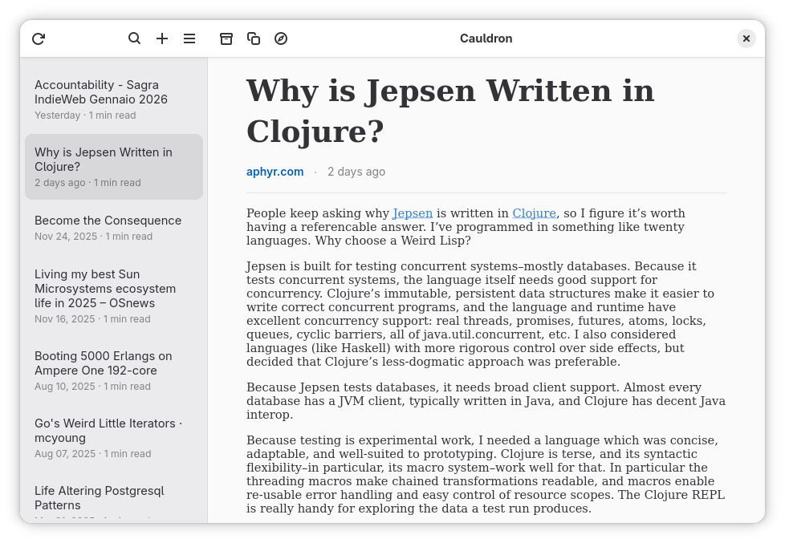

# Cauldron

[](https://github.com/dottorblaster/cauldron/actions/workflows/ci.yml)

Cauldron is a GNOME desktop application written in Rust that allows you to read articles stored in your Pocket account. It is built using the GTK toolkit as the graphical library.


<div align="center">


</div>

## Features

- **Instapaper Integration**: Cauldron seamlessly integrates with your Instapaper account, allowing you to access and read the articles you have saved.
- **Native Article View**: Read your saved content directly in the app with a clean, distraction-free reading experience.
- **Add Bookmarks**: Save new articles to your Instapaper account directly from Cauldron without leaving the app.
- **Article Filtering**: Quickly find specific articles with built-in search and filtering capabilities.
- **Article Metadata**: View useful information like author, word count, and estimated reading time for each article.
- **Persistent Storage**: Your articles are cached locally and persist across app restarts for quick access.
- **GNOME-Friendly UI**: The application's user interface is designed to blend in with the GNOME desktop environment, providing a native and intuitive experience.
- **Responsive Design**: Cauldron's layout adapts to different screen sizes and resolutions, ensuring a great experience on a variety of devices.
- **Dark Mode**: Full support for both light and dark themes that adapt to your system preferences.

## Installation

<a href='https://flathub.org/apps/it.dottorblaster.cauldron' target="_blank">
    
</a>

Cauldron is available as a Flatpak package, making it easy to install and run on your GNOME-based system. You can find the latest release on Flathub.

## Getting Started

- Install the Cauldron Flatpak package from the GNOME Flathub.
- Launch the application from your GNOME application menu.
- Sign in to your Instapaper account when prompted.
- Start reading your saved articles!

## Building the project

Make sure you have `flatpak` and `flatpak-builder` installed. Then run the commands below. Please note that these commands are just for demonstration purposes. Normally this would be handled by your IDE, such as GNOME Builder or VS Code with the Flatpak extension.

```shell
flatpak install --user org.gnome.Sdk//49 org.gnome.Platform//49 org.freedesktop.Sdk.Extension.rust-stable//25.08 org.freedesktop.Sdk.Extension.llvm20//25.08
flatpak-builder --user flatpak_app build-aux/it.dottorblaster.cauldron.Devel.json
```

## Running the project

Once the project is build, run the command below. Please note that these commands are just for demonstration purposes. Normally this would be handled by your IDE, such as GNOME Builder or VS Code with the Flatpak extension.

```shell
flatpak-builder --run flatpak_app build-aux/it.dottorblaster.cauldron.Devel.json cauldron
```

## Community

Join the GNOME and gtk-rs community!

- [Matrix chat](https://matrix.to/#/#rust:gnome.org): chat with other developers using gtk-rs
- [Discourse forum](https://discourse.gnome.org/tag/rust): topics tagged with `rust` on the GNOME forum.
- [GNOME circle](https://circle.gnome.org/): take inspiration from applications and libraries already extending the GNOME ecosystem.

## Credits

- [Podcasts](https://gitlab.gnome.org/World/podcasts)
- [Shortwave](https://gitlab.gnome.org/World/Shortwave)
